使用JAVA API操作HDFS文件
* IDEA+Maven创建Java工程
* 添加HDFS相关依赖
* 开发JAVA API操作HDFS文件

# IDEA环境配置

首先打开IDEA,选择Maven项目，选择quickstart接着下一步
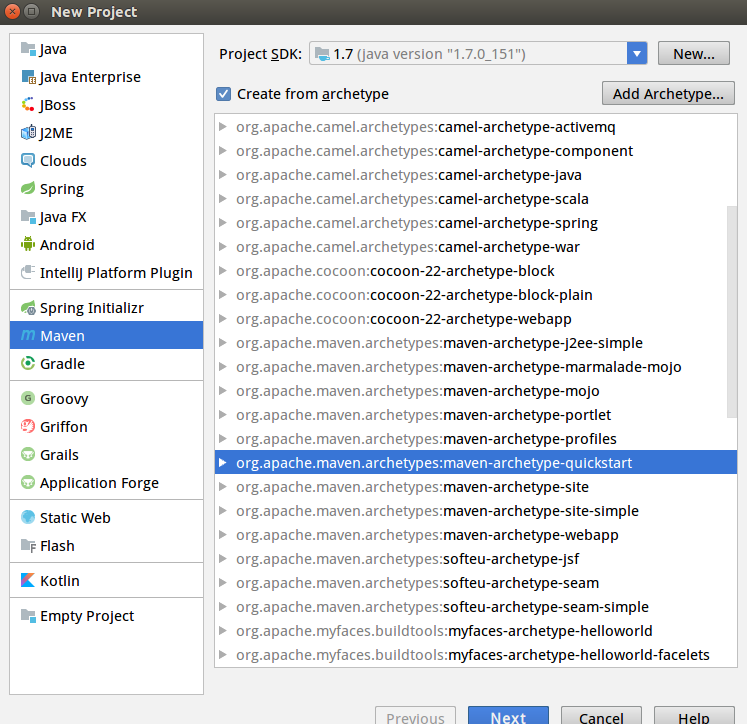

输入一些基本信息


这里IDEA有自己集成的Maven版本,在`User settings file`可以使用系统自带的xml文件，也可以选择自己下载的Maven。
可以在网上下载一个Maven压缩包，解压到指定的文件夹，在使用的时候选择这个文件夹下的`settings.xml`就行了。

同样的`Local repository`也可以自己选择一个本地目录。
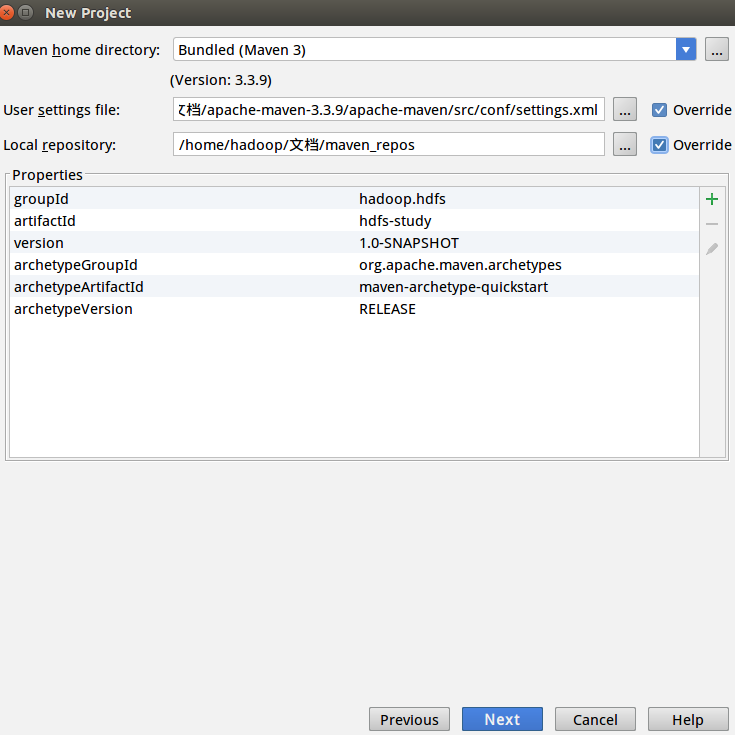

下一步填一些基本信息
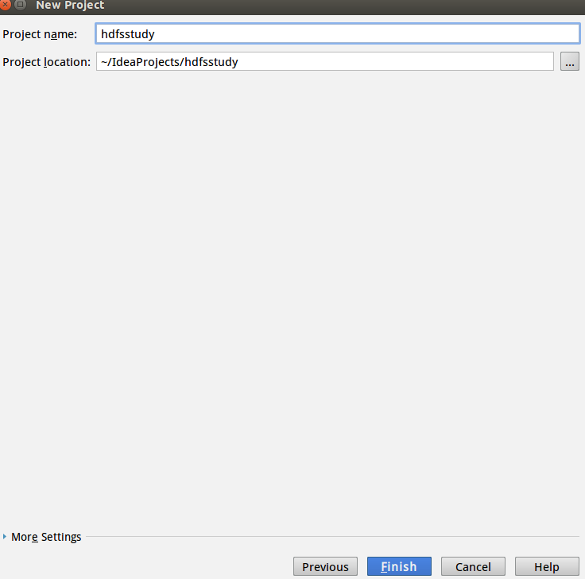

然后等待Maven初始化完成，可以看到下面console窗口的SUCCESS信息。
初始的项目集成了单元测试`junit`包。


接着配置开发hadoop需要的依赖。
如图，添加
```xml
<dependency>
    <groupId>org.apache.hadoop</groupId>
    <artifactId>hadoop-client</artifactId>
    <version>2.9.0</version>
</dependency>
```
这里我配置的hadoop依赖版本是2.9.0,根据自己的实际版本进行修改
另外，这里的`${hadoop.version}`在上面的`<properties></properties>`标签中进行了配置，其实和上面的代码的效果是一样的。

然后Maven会自己下载相应的依赖，可以看到在右侧已经下载成功所需的依赖。

然后在右侧栏的`hadoop.hdfs`中新加一个包，然后新建一个类进行测试

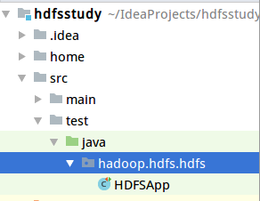

以下是单元测试代码，其中的路径参数是我自己系统上的路径，在开发时自行替换为自己的开发测试路径。
```java
package hadoop.hdfs.hdfs;

import org.apache.hadoop.conf.Configuration;
import org.apache.hadoop.fs.*;
import org.apache.hadoop.io.IOUtils;
import org.apache.hadoop.util.Progressable;
import org.junit.After;
import org.junit.Before;
import org.junit.Test;

import java.io.BufferedInputStream;
import java.io.File;
import java.io.FileInputStream;
import java.io.InputStream;
import java.net.URI;

/**
 * hadoop HDFS java API 操作
 */
public class HDFSApp {
    public static final String HDFS_PATH = "hdfs://localhost:9000";

    FileSystem fileSystem = null;
    Configuration configuration = null;

    /**
     *创建hdfs目录
     */
    @Test
    public void mkdir() throws Exception {
        fileSystem.mkdirs(new Path("/hdfsapi/test"));
    }

    @Test
    public void createFile() throws Exception {
        FSDataOutputStream out = fileSystem.create(new Path("/hdfsapi/test/a.txt"));
        out.write("hello hdfs".getBytes());
        out.flush();
        out.close();
    }

    /**
     * 查看hdfs文件的内容
     */
    @Test
    public void catFile() throws Exception {
        FSDataInputStream in = fileSystem.open(new Path("/hdfsapi/test/a.txt"));
        IOUtils.copyBytes(in,System.out,1024);
        System.out.println();
        in.close();
    }

    /**
     *重命名文件名
     */
    @Test
    public void renameFile() throws Exception {
        Path oldPath = new Path("/hdfsapi/test/a.txt");
        Path newPath = new Path("/hdfsapi/test/b.txt");
        if(fileSystem.rename(oldPath,newPath)){
            System.out.println("rename success!");
        }
    }

    /**
     * 从本地拷贝一个文件
     */
    @Test
    public void copyFromLocalFile() throws Exception {
        Path localPath = new Path("/home/hadoop/study/data/hello.txt");
        Path hdfsPath = new Path("/hdfsapi/test");
        fileSystem.copyFromLocalFile(localPath,hdfsPath);
    }

    /**
     * 从本地拷贝一个大文件，并且带进度条
     */
    @Test
    public void copyFromLocalFileWithProgress() throws Exception {
        InputStream in = new BufferedInputStream(
                new FileInputStream(
                        new File("/home/hadoop/下载/hadoop-2.9.0.tar.gz")));
        FSDataOutputStream out = fileSystem.create(
                new Path("/hdfsapi/test/hadoop-2.9.0.tar.gz"),
                new Progressable() {
                    @Override
                    public void progress() {
                        System.out.print(".");
                    }
        });

        IOUtils.copyBytes(in,out,4096);
    }

    /**
     * 下载HDFS文件到本地
     */
    @Test
    public void copyToLocalFile() throws Exception {
        Path localpath = new Path("/home/hadoop/study/data/b.txt");
        Path hdfspath = new Path("/hdfsapi/test/b.txt");

        fileSystem.copyToLocalFile(hdfspath,localpath);
    }

    /**
     * 获取目录下的所有文件和文件夹
     */
    @Test
    public void listFiles() throws Exception {
        FileStatus[] fileStatus = fileSystem.listStatus(new Path("/"));
        for(FileStatus filestatus : fileStatus){
            String Status = filestatus.isDirectory() ? "文件夹" : "文件";
            short replication = filestatus.getReplication(); //副本数
            long len = filestatus.getLen(); //文件大小
            String path = filestatus.getPath().toString();

            System.out.println(Status + " " + replication+ " " +len+ " " +path);
        }
    }

    /**
     * 删除文件
     */
    @Test
    public void deleteFile() throws Exception {
        fileSystem.delete(new Path(""),true);
    }
    /**
     * 在所有的单元测试之前执行的
     */
    @Before
    public void setUp() throws Exception {
        System.out.println("HDFS setUp");
        configuration = new Configuration();
        fileSystem = FileSystem.newInstance(new URI(HDFS_PATH),configuration);
    }

    /**
     * 在所有的单元测试执行完之后执行的,释放资源
     */
    @After
    public void tearDown() throws Exception {
        configuration = null;
        fileSystem = null;
        System.out.println("HDFS tearDown");
    }
}

```

# HDFS工作流程

下面是在网上看到的漫画版的解释HDFS的工作流程，值得反复阅读，这里贴上来感谢作者！

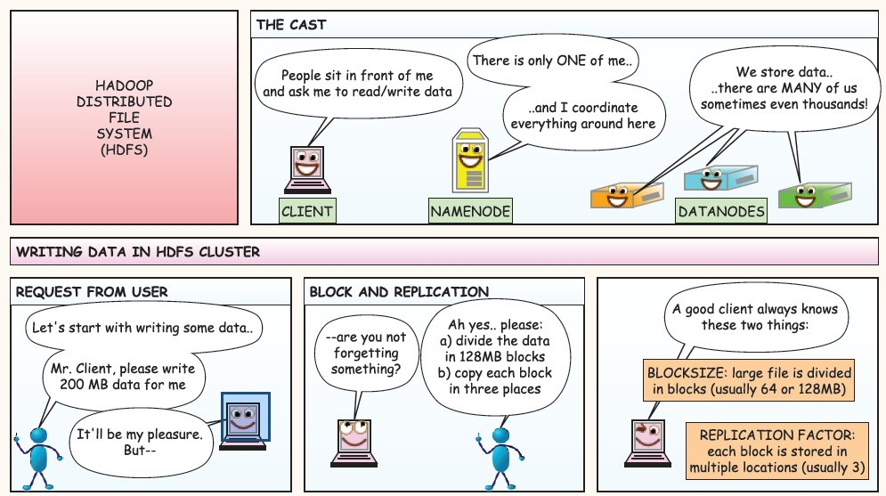
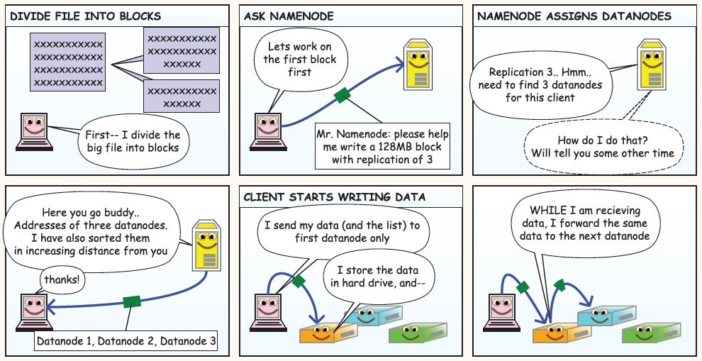
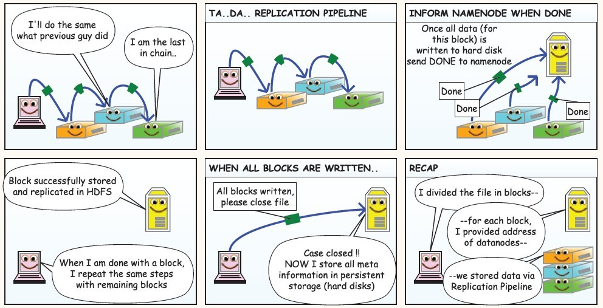
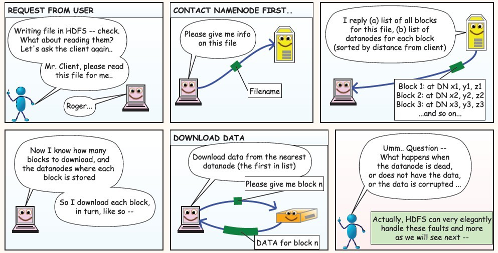
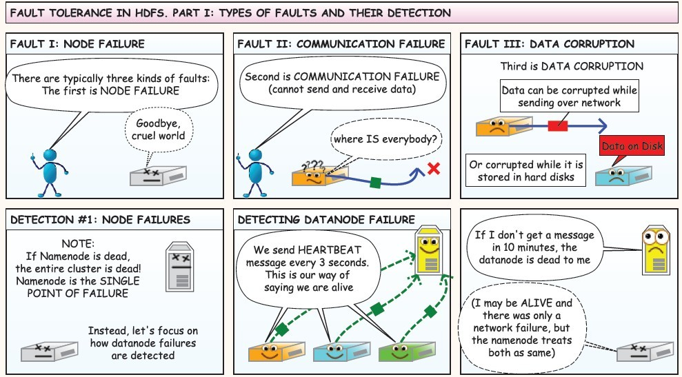
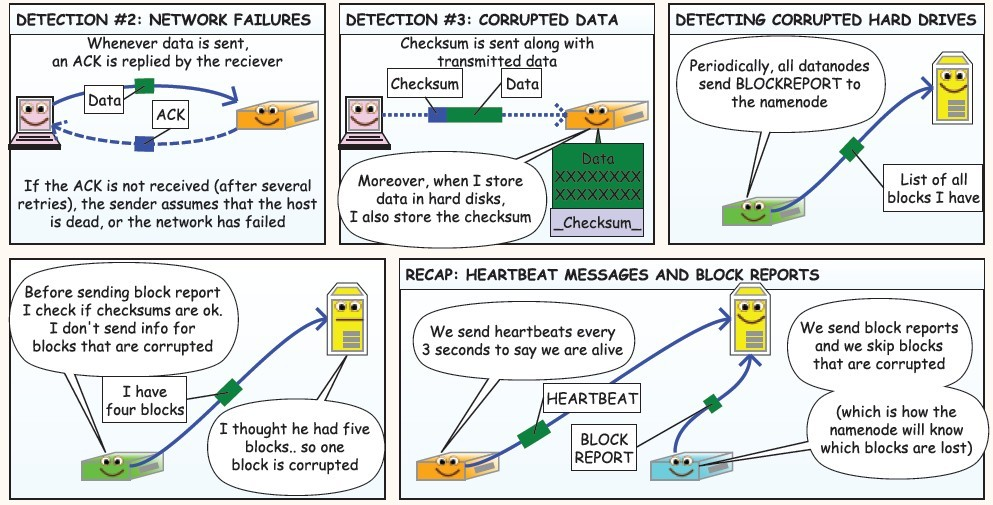

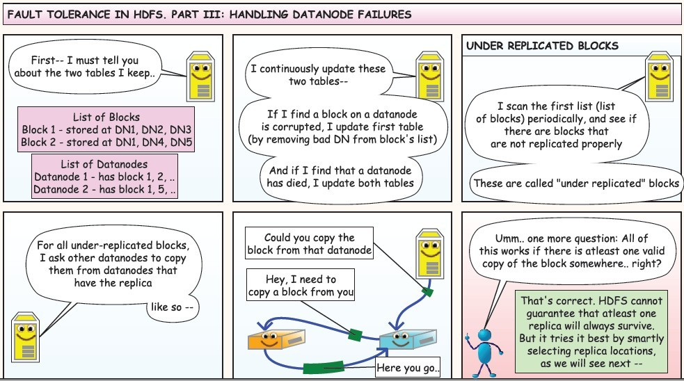
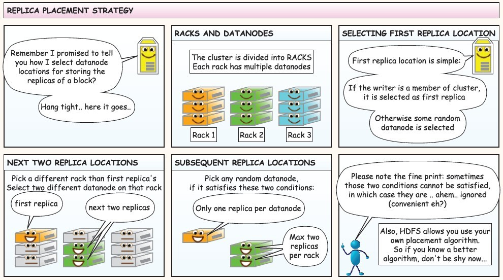
