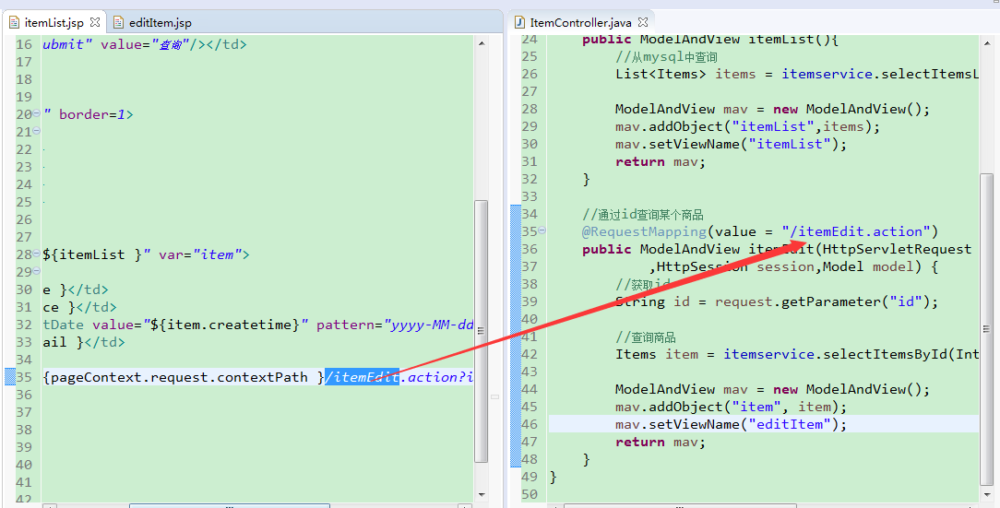
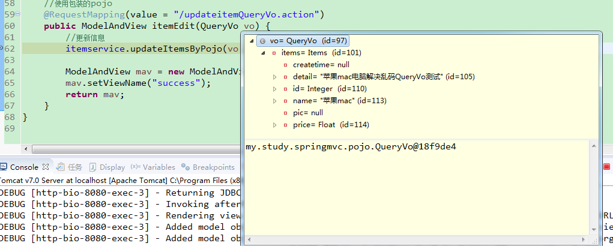

# 参数绑定
## 默认支持的参数类型

需求：打开商品编辑页面，展示商品信息

在[SpringMVC+Mybatis整合](https://homxuwang.github.io/2018/12/01/SpringMVC-Mybatis%E6%95%B4%E5%90%88/)
的基础上，进行商品编辑的功能开发。

需求分析:编辑商品信息，首先要显示商品详情
需要根据商品id查询商品信息，然后展示到页面。
请求的url：/itemEdit.action
参数：id（商品id）
响应结果：商品编辑页面，展示商品详细信息。

在`ItemService.java`接口中添加方法:
```java
//通过id查询某个商品
public Items selectItemsById(Integer id);
```
在`ItemServiceImpl.java`类中实现方法:
```java
//查询某个商品
public Items selectItemsById(Integer id) {
  return itemsmapper.selectByPrimaryKey(id);
}
```

在Controller中书写方法:
```java
//通过id查询某个商品
@RequestMapping(value = "/itemEdit.action")
public ModelAndView itemEdit(HttpServletRequest request,HttpServletResponse response
    ,HttpSession session,Model model) {
  //获取id
  String id = request.getParameter("id");
  
  //查询商品
  Items item = itemservice.selectItemsById(Integer.parseInt(id));
  
  ModelAndView mav = new ModelAndView();
  mav.addObject("item", item);
  mav.setViewName("editItem");
  return mav;
}
```


测试结果:


## 绑定简单类型

当请求的参数名称和处理器形参名称一致时会将请求参数与形参进行绑定。
这样，从Request取参数的方法就可以进一步简化。
```java
//通过id查询某个商品
	@RequestMapping(value = "/itemEdit.action")
	public ModelAndView itemEdit(Integer id,HttpServletRequest request,HttpServletResponse response
			,HttpSession session,Model model) {		
		//查询商品
		Items item = itemservice.selectItemsById(id);
		
		ModelAndView mav = new ModelAndView();
		mav.addObject("item", item);
		mav.setViewName("editItem");
		return mav;
	}
```
### @RequestParam
当请求的参数名称和处理器形参名称不一致时，使用@RequestParam常用于处理简单类型的绑定。

value：参数名字，即入参的请求参数名字，如value=“itemId”表示请求的参数区中的名字为itemId的参数的值将传入

required：是否必须，默认是true，表示请求中一定要有相应的参数，否则将报错
TTP Status 400 - Required Integer parameter 'XXXX' is not present
如果想设置为可以为空，则将requied设置为false

defaultValue：默认值，表示如果请求中没有同名参数时的默认值

```java
//通过id查询某个商品
	@RequestMapping(value = "/itemEdit.action")
	public ModelAndView itemEdit(@RequestParam(value="id",required=false,defaultValue="1") Integer value,HttpServletRequest request,HttpServletResponse response
			,HttpSession session,Model model) {		
		//查询商品
		Items item = itemservice.selectItemsById(value);
		
		ModelAndView mav = new ModelAndView();
		mav.addObject("item", item);
		mav.setViewName("editItem");
		return mav;
	}
```

## 参数绑定之POJO
如果提交的参数很多，或者提交的表单中的内容很多的时候,可以使用简单类型接受数据,也可以使用pojo接收数据。
要求：pojo对象中的属性名和表单中input的name属性一致。

ItemService里编写接口方法
```java
//通过pojo更新商品信息
	public void updateItemsByPojo(Items item);
```
ItemServiceImpl.java编写方法
```java
//通过pojo更新商品信息
	public void updateItemsByPojo(Items items) {
		items.setCreatetime(new Date());
		itemsmapper.updateByPrimaryKeyWithBLOBs(items);
	}
```

在Controller中书写代码:
```java
@RequestMapping(value = "/updateitem.action")
	public ModelAndView itemEdit(Items items) {
		//更新信息
		itemservice.updateItemsByPojo(items);
		
		ModelAndView mav = new ModelAndView();
		mav.addObject("item", items);
		mav.setViewName("success");
		return mav;
	}
```

但是提交的内容会有乱码

## 解决提交内容乱码问题
### post
在web.xml中加入过滤器，解决post提交乱码问题：
```xml
<!-- 解决post乱码问题 -->
	<filter>
		<filter-name>encoding</filter-name>
		<filter-class>org.springframework.web.filter.CharacterEncodingFilter</filter-class>
		<!-- 设置编码参是UTF8 -->
		<init-param>
			<param-name>encoding</param-name>
			<param-value>UTF-8</param-value>
		</init-param>
	</filter>
	<filter-mapping>
		<filter-name>encoding</filter-name>
		<url-pattern>*.action</url-pattern>
	</filter-mapping>
```

再次修改测试：


## 参数绑定之包装的POJO
使用包装的pojo接收商品信息的查询条件。
创建包装对象:
```java
package my.study.springmvc.pojo;

public class QueryVo {
	private Items items;
  //get/set...
}
```
Controller中的代码:
```java
//使用包装的pojo
	@RequestMapping(value = "/updateitemQueryVo.action")
	public ModelAndView itemEdit(QueryVo vo) {
		//更新信息
		itemservice.updateItemsByPojo(vo.getItems());
		
		ModelAndView mav = new ModelAndView();
		mav.setViewName("success");
		return mav;
	}
```
这时候前端页面要修改为其`成员变量.属性名`的格式:

修改form的提交地址后测试，可以看到后台正确接收到值，并且修改成功



## 自定义参数绑定
需求：在商品修改页面可以修改商品的生产日期，并且根据业务需求自定义日期格式。

由于日期数据有很多种格式，springmvc没办法把字符串转换成日期类型。所以需要自定义参数绑定。
负责处理这部分的是springMVC的适配器
在jsp页面添加显示和修改日期的部分:
```jsp
<tr>
  <td>商品生产日期</td>
  <td><input type="text" name="items.createtime"
    value="<fmt:formatDate value="${item.createtime}" pattern="yyyy-MM-dd HH:mm:ss"/>" /></td>
</tr>
```
吧`ItemServiceImpl.java`中写入时间的代码删除:
```java
//通过pojo更新商品信息
	public void updateItemsByPojo(Items items) {
//		items.setCreatetime(new Date());
		itemsmapper.updateByPrimaryKeyWithBLOBs(items);
	}
```

自定义Converter,假如传入的日期为`2018:12-04 16_:_34-26`：
```java
//Converter<S, T>
//S:source,需要转换的源的类型
//T:target,需要转换的目标类型
public class DateConverter implements Converter<String, Date> {

	@Override
	public Date convert(String source) {
		try {
			// 把字符串转换为日期类型
			SimpleDateFormat simpleDateFormat = new SimpleDateFormat("yyyy:MM-dd HH_mm-ss");
			Date date = simpleDateFormat.parse(source);

			return date;
		} catch (ParseException e) {
			// TODO Auto-generated catch block
			e.printStackTrace();
		}
		// 如果转换异常则返回空
		return null;
	}
}
```

在`springmvc.xml`中配置Converter:
```xml
<mvc:annotation-driven conversion-service="ConversionServiceFactory" />

<!-- 转换器配置 -->
<bean id="ConversionServiceFactory" class="org.springframework.format.support.FormattingConversionServiceFactoryBean">
	<property name="converters">
		<list>
			<bean class="my.study.springmvc.conversion.DateConverter"/>
		</list>
	</property>
</bean>
```
在修改日期处填写日期`2016:12-04 16_43-52`进行测试:


# 附录

## editItem.jsp
```jsp
<%@ page language="java" contentType="text/html; charset=UTF-8"
    pageEncoding="UTF-8"%>
<%@ taglib uri="http://java.sun.com/jsp/jstl/core" prefix="c" %>
<%@ taglib uri="http://java.sun.com/jsp/jstl/fmt"  prefix="fmt"%>
<!DOCTYPE html PUBLIC "-//W3C//DTD HTML 4.01 Transitional//EN" "http://www.w3.org/TR/html4/loose.dtd">
<html>
<head>
<meta http-equiv="Content-Type" content="text/html; charset=UTF-8">
<title>修改商品信息</title>

</head>
<body> 
	<!-- 上传图片是需要指定属性 enctype="multipart/form-data" -->
	<!-- <form id="itemForm" action="" method="post" enctype="multipart/form-data"> -->
	<form id="itemForm"	action="${pageContext.request.contextPath }/updateitem.action" method="post">
		<input type="hidden" name="id" value="${item.id }" /> 修改商品信息：
		<table width="100%" border=1>
			<tr>
				<td>商品名称</td>
				<td><input type="text" name="name" value="${item.name }" /></td>
			</tr>
			<tr>
				<td>商品价格</td>
				<td><input type="text" name="price" value="${item.price }" /></td>
			</tr>
			<tr>
				<td>商品简介</td>
				<td><textarea rows="3" cols="30" name="detail">${item.detail }</textarea>
				</td>
			</tr>
			<tr>
				<td colspan="2" align="center"><input type="submit" value="提交" />
				</td>
			</tr>
		</table>

	</form>
</body>

</html>
```