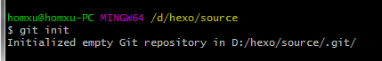

因为hexo博客之前出过一些问题，导致之前做的git笔记被覆盖掉丢失了。所以这次再一次整理一下git的一些常用操作并记录下来。

# 创建仓库

进入到要创建仓库的文件夹,输入命令
`git init`
这时候会有提示 
然后目录下会多一个`.git`的隐藏文件夹。

另外一种方式
`git init demo` 初始化到一个叫demo的自定义文件夹

另外可以从远程仓库初始化
`git clone https://github.com/xxxxxxxxx.git` 克隆项目

`git clone https://github.com/xxxxxxxxx.git demo` 克隆项目到一个叫demo的自定义文件夹

# 基本用法

`git status` 查看仓库状态

No commits yet 是指没有提交记录
Untracked files 是指未跟踪到的文件，指有文件更改了但是没有commit

`git add .` 将所有修改添加至暂存区

`git commit -m "描述"`  提交版本

根据`表严肃`老师的视频进行整理 http://biaoyansu.com/27.2