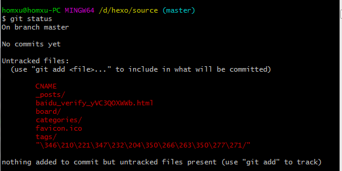

因为hexo博客之前出过一些问题，导致之前做的git笔记被覆盖掉丢失了。所以这次再一次整理一下git的一些常用操作并记录下来。

# 创建仓库

进入到要创建仓库的文件夹,输入命令
`git init`
这时候会有提示 
然后目录下会多一个`.git`的隐藏文件夹。

另外一种方式
`git init demo` 初始化到一个叫demo的自定义文件夹

另外可以从远程仓库初始化
`git clone https://github.com/xxxxxxxxx.git` 克隆项目

`git clone https://github.com/xxxxxxxxx.git demo` 克隆项目到一个叫demo的自定义文件夹

# 基本用法

`git status` 查看仓库状态

No commits yet 是指没有提交记录
Untracked files 是指未跟踪到的文件，指有文件更改了但是没有commit

`git add .` 将所有修改添加至暂存区

`git commit -m "描述"`  提交版本(即在这个历史节点下修改和做了什么)

这时候再查看仓库状态，可以看到nothing to commit

`git log` 查看版本记录
黄色的一串字母数字组合表示唯一标识

下面则是描述说明的内容

`git log -p`可以看到修改的具体信息

`git checkout xxx` 穿越到指定的历史节点,xxx表示上面的唯一标识,可以不用输入全部()

`git checkout -` 回到原来的节点

# 三种状态

`modefied` 已修改
`staged` 已暂存(缓冲阶段)
`commited` 已提交

# 标签tag

项目开发中，在版本提交时会有很多小版本，但是其中有一些节点很重要，比如完成某些重要的功能，可以在这个重要的节点使用标签做标记。

根据`表严肃`老师的视频进行整理 http://biaoyansu.com/27.2