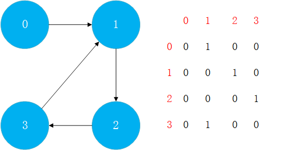
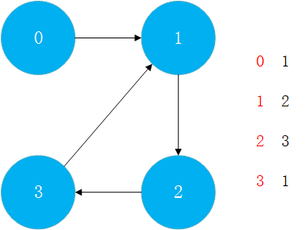
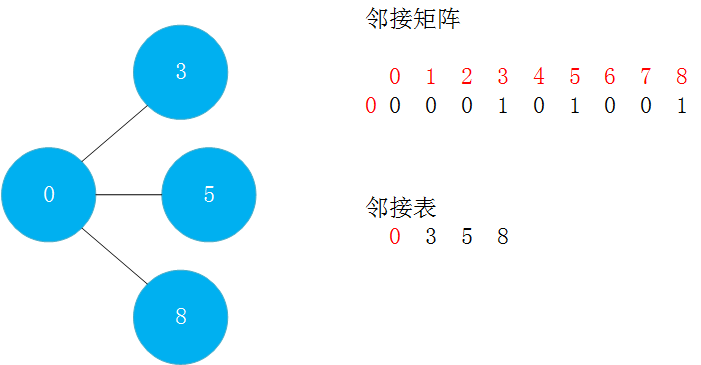
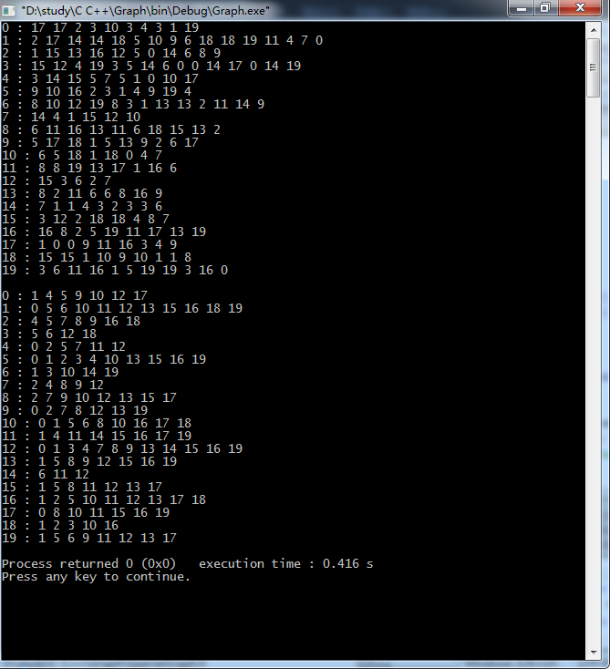
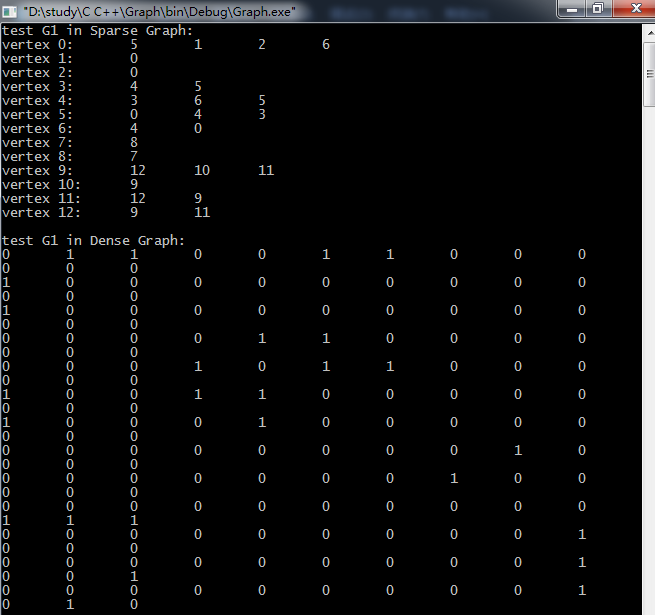
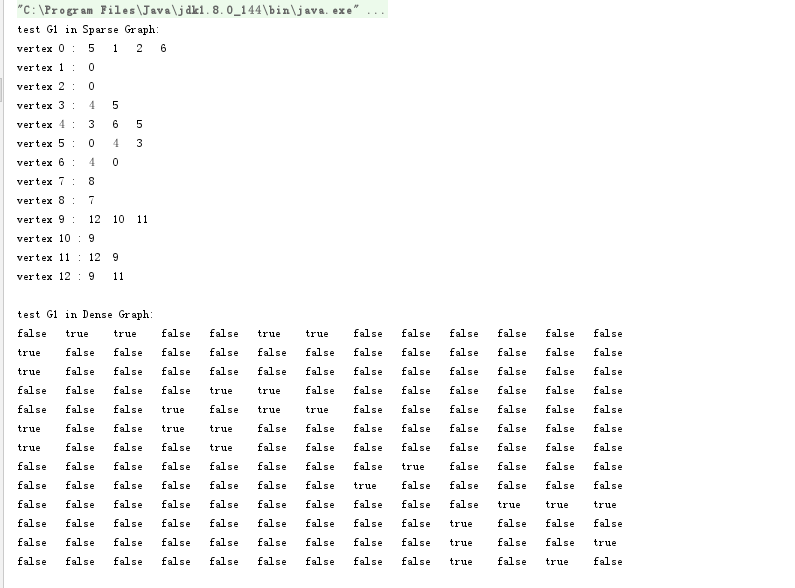
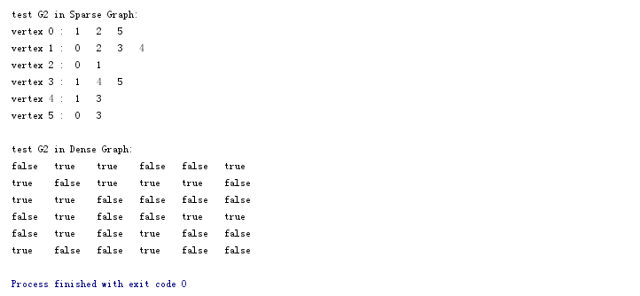

图主要是节点和边组成的模型。图可以用来表达真实世界中的很多关系，如交通运输、社交网络、互联网等。
图分为有向图（Directed Graph）和无向图（Undirected Graph），有向图由于其不对称性，所有有时候会涉及很多比较难的算法。可以把无向图看成一种特殊的有向图。
图也可以分为有权图（Weighted Graph）和无权图（Unweighted Graph），权是指节点与节点之间的边的数值。
图不一定都要连接起来，比如一个模型中有三个没有连通起来的图。
有的图中有可能会有自环边（self-loop）和平行边（parallel-edges），简单图（Simple Graph）就是指没有自环边和平行边的图，因为有了自环边和平行边，那么算法可能会更加复杂。

# 图的表示

## 邻接矩阵

一种方法是使用邻接矩阵（Adjacency Matrix）表示一张图。
使用邻接矩阵表示这个无向图，a[i,j]代表的值为0或1。0代表不相连，1代表相连。这个矩阵是关于对角线对称的。

也可以使用邻接矩阵表示有向图。例如，0->1存在有向边，那么a[0,1]=1;但是1->0不存在有向边，所以a[1,0]=0。


## 邻接表

邻接表（Adjacency Lists）只表达和某个顶点相连接的顶点的信息。对于每一行来说都相当于一个链表，存放了对于该节点相连的所有节点。

同样，邻接表也可以表达有向图。


由此可见，邻接表的占用空间要比邻接矩阵小。
邻接表适合表示稀疏图（Sparse Graph）
邻接矩阵适合表示稠密图（Dense Graph）
>数据结构中对于稀疏图的定义为：有很少条边或弧（边的条数|E|远小于|V|²）的图称为稀疏图（sparse graph），反之边的条数|E|接近|V|²，称为稠密图（dense graph）。——百度百科
稠密图的一个极端情况就是完全图，即所有的点之间都互相连接。这种情况使用邻接矩阵进行存储会更好。

## 代码实现

### C++
`DenseGraph.h`
```c
#ifndef GRAPH_DENSEGRAPH_H
#define GRAPH_DENSEGRAPH_H

#include <iostream>
#include <vector>
#include <cassert>

using namespace std;

//稠密图 - 邻接矩阵
class DenseGraph{

private:
    int n,m;//点数和边数
    bool directed;//有向还是无向图
    vector<vector<bool> > g; //true表示有这条边,false表示没有

public:
    DenseGraph( int n , bool directed){
        this->n = n;//n个顶点
        this->m = 0;//初始为0条边
        this->directed = directed;
        for( int i = 0 ; i < n ; i ++)
            g.push_back( vector<bool>( n, false ));
    }

    ~DenseGraph() {

    }

    int V(){return n;}//返回顶点数
    int E(){return m;}//返回边数

    void addEdge( int v , int w){ //在顶点v和w间建立一条边
        //保证v和w不越界
        assert( v >= 0 && v < n );
        assert( w >= 0 && w < n );
        //先判断v和w之间是否已经有边
        if( hasEdge( v, w )) //这里避免了产生平行边的情况，这也是使用邻接矩阵的优点
            return;

        g[v][w] = true; //如果是有向图，只需运行这一句话
        if( !directed ) //如果是无向图
            g[w][v] = true;

        m++; //维护边数
    }

    bool hasEdge( int v , int w ){ //判断两个顶点是否已经有边
        //保证v和w不越界
        assert( v >= 0 && v < n );
        assert( w >= 0 && w < n );

        return g[v][w];
    }
};

#endif // GRAPH_DENSEGRAPH_H
```
`SparseGraph.h`
```c
#ifndef GRAPH_SPARSEGRAPH_H
#define GRAPH_SPARSEGRAPH_H

#include <iostream>
#include <vector>
#include <cassert>

using namespace std;

//稀疏图 - 邻接表
class SparseGraph{

private:
    int n,m;
    bool directed;
    vector<vector<int> > g;  // 图的具体数据

public:
    SparseGraph( int n , bool directed ){
        this->n = n;
        this->m = 0;
        this->directed = directed;
        for( int i = 0 ; i < n ; i ++){
            g.push_back(vector<int>()); //初始化时为空，因为初始化时没有顶点相连接，这里也可以用链表实现，使用链表在删除时效率高
        }
    }

    ~SparseGraph(){}

    int V(){return n;}
    int E(){return m;}

    //在使用邻接表进行表达的时候，通常允许有平行边
    //因为addEdge时，每进行一次添加，都要调用hasEdge进行判断，而hasEdge最差的时间复杂度为O(n)
    //所以addEdge也会退化为O(n)，一般在所有的边添加完成后再进行一次综合检查，去除平行边
    void addEdge( int v , int w ){
         //保证v和w不越界
        assert( v >= 0 && v < n );
        assert( w >= 0 && w < n );

        g[v].push_back(w);//v和w相连
        if( v != w && !directed ) //如果v不是自环边且不是有向图
            g[w].push_back(v);

        m ++;
    }

    bool hasEdge( int v , int w ){

        assert( v >= 0 && v < n );
        assert( w >= 0 && w < n );

        for( int i = 0 ; i < g[v].size() ; i++ )
            if( g[v][i] == w )
                return true;
        return false;
    }

};

#endif // GRAPH_SPARSEGRAPH_H
```

# 遍历临边——相邻点迭代器

在图的操作中，有一个基础操作——遍历临边。下图是对0节点表达临边时邻接矩阵和邻接表的不同。这个图也反映了遍历0的临边的方法。



下面制作一个迭代器，用来访问一个顶点的所有临边。

`SparseGraph.h`
```c
#ifndef GRAPH_SPARSEGRAPH_H
#define GRAPH_SPARSEGRAPH_H

#include <iostream>
#include <vector>
#include <cassert>

using namespace std;

//稀疏图 - 邻接表
class SparseGraph{
    //...........省略代码
     // 邻边迭代器, 传入一个图和一个顶点,
    // 迭代在这个图中和这个顶点向连的所有顶点
class adjIterator {
private:
    SparseGraph &G; // 图G的引用
    int v;
    int index;
public:
    // 构造函数
    adjIterator(SparseGraph &graph, int v ): G(graph){
        this->v = v;
        this->index = 0;
    }

    ~adjIterator(){}

    // 返回图G中与顶点v相连接的第一个顶点
    int begin(){
        index = 0;
        if( G.g[v].size() )
            return G.g[v][index];//即g[v][0]
        // 若没有顶点和v相连接, 则返回-1
        return -1 ;
    }
    // 返回图G中与顶点v相连接的下一个顶点
    int next(){
        index ++;
        if( index < G.g[v].size() )
            return G.v[v][index];
        // 若没有顶点和v相连接, 则返回-1
        return -1;
    }

    bool end(){ //判断是否迭代完成
        return index >= G.g[v].size();
    }
}
}
#endif // GRAPH_SPARSEGRAPH_H
```


在`main`中进行测试：
```c
#include <iostream>
#include <stdlib.h>
#include <time.h>
#include "SparseGraph.h"
#include "DenseGraph.h"

using namespace std;

int main() {

    int N = 20;
    int M = 100;

    srand( time(NULL) );


    // Sparse Graph
    SparseGraph g1(N , false);
    for( int i = 0 ; i < M ; i ++ ){
        int a = rand()%N;
        int b = rand()%N;
        g1.addEdge( a , b );
    }

    // O(E)
    for( int v = 0 ; v < N ; v ++ ){
        cout<<v<<" : ";
        SparseGraph::adjIterator adj( g1 , v );
        for( int w = adj.begin() ; !adj.end() ; w = adj.next() )
            cout<<w<<" ";
        cout<<endl;
    }

    cout<<endl;
    return 0;
}
```


可以看到稀疏图冲存在平行边，但是稠密图中没有平行边。稀疏图的遍历时间复杂度为O(E),稠密图的时间复杂度为O(V^2)。E为边数，V为顶点数。

# 图的算法框架

创建文件`testG1.txt`，用文件来表示一个图。如下面的数据：第一行表示有13个节点和13条边，第二行`0 5`则表示节点0 和 5之间有一条边。
```
13 13
0 5
4 3
0 1
9 12
6 4
5 4
0 2
11 12
9 10
0 6
7 8
9 11
5 3
```
同样创建第二个文件`testG2.txt`表示另一个图：
```
6 8
0 1
0 2
0 5
1 2
1 3
1 4
3 4
3 5
```

下面设计一个从文件中读取图的算法（无论是稀疏图还是稠密图都通用）,封装在`ReadGraph.h`类中。该类是一个模板类，指定一个图的引用和一个用来表示图的文件，将文件中存放的数据存到图中。

```c
#ifndef READGRAPH_H_INCLUDED
#define READGRAPH_H_INCLUDED

#include <iostream>
#include <string>
#include <fstream>
#include <sstream>
#include <cassert>

using namespace std;

template <typename Graph>
class ReadGraph{

public:
    ReadGraph(Graph &graph,const string &filename){

        ifstream file(filename);
        string line;
        int V,E;

        assert( file.is_open() );

        //首先读取顶点数和边数
        assert( getline(file,line) );
        stringstream ss(line);
        ss>>V>>E;

        assert( V == graph.V() );

        //然后创建图
        for( int i = 0 ; i < E ; i++){
            assert( getline(file,line) );
            stringstream ss(line);

            int a,b;
            ss>>a>>b;

            assert( a >= 0 && a < V );
            assert( b >= 0 && b < V );
            graph.addEdge( a , b );
        }
    }

};

#endif // READGRAPH_H_INCLUDED
```

在`SparseGraph.h`和`DenseGraph.h`中添加一个方法`show()`用来打印图:
`SparseGraph.h`
```c
void show(){
    for( int i = 0 ; i < n ; i++){
        cout<<"vertex "<<i<<":\t";
        for(int j = 0 ; j < g[i].size() ; j++ ){
            cout<<g[i][j]<<"\t";
        }
        cout<<endl;
    }
}
```
`DenseGraph.h`
```c
void show(){
    for(int i = 0 ; i < n ; i++){
        for( int j = 0 ; j < n ; j ++)
            cout<<g[i][j]<<"\t";
        cout<<endl;
    }
}
```

在main函数中进行测试:
```c
#ifndef READGRAPH_H_INCLUDED
#define READGRAPH_H_INCLUDED

#include <iostream>
#include <string>
#include <fstream>
#include <sstream>
#include <cassert>

using namespace std;

template <typename Graph>
class ReadGraph{

public:
     // 从文件filename中读取图的信息, 存储进图graph中
    ReadGraph(Graph &graph, const string &filename){

        ifstream file(filename.c_str());
        string line;
        int V,E;

        assert( file.is_open() );

        //首先读取顶点数和边数
        assert( getline(file,line) );
        stringstream ss(line);
        ss>>V>>E;

        assert( V == graph.V() );

        //然后创建图
        for( int i = 0 ; i < E ; i++){
            assert( getline(file,line) );
            stringstream ss(line);

            int a,b;
            ss>>a>>b;

            assert( a >= 0 && a < V );
            assert( b >= 0 && b < V );
            graph.addEdge( a , b );
        }
    }

};
#endif // READGRAPH_H_INCLUDED
```
可以看到使用邻接矩阵和邻接表创建的图的结果:



# java表达

首先定义图的接口`Graph.java`
```java
//图的接口
public interface Graph {

    public int V();  //获取图的顶点数
    public int E();  //获取图的边数
    public void addEdge( int v ,int w); //在v和w两个顶点间添加一条边
    boolean hasEdge( int v , int w);//查看v和w两个顶点间是否有边
    void show();//打印图
    public Iterable<Integer> adj(int v); //获取与v顶点连接的所有边
}
```

定义稠密图`DenseGraph.java`:
```java
import java.util.Vector;

//稠密图 - 邻接矩阵
public class DenseGraph implements Graph{

    private int n; //节点数
    private int m; //边数
    private boolean directed; // 是否为有向图
    private boolean[][] g; //图的具体数据，用二维数组表达

    //构造函数
    public DenseGraph( int n , boolean directed){
        if(n < 0)//保证n要>=0
            throw new IllegalArgumentException("the value of n should be >= 0."); 
        this.n = n;
        this.m = 0 ;//初始化时没有任何边
        this.directed = directed;
        //g初始化时为n*n的布尔型矩阵,每个g[i][j]均为false，因为开始时没有任何边
        //false为boolean型变量的默认值
        g = new boolean[n][n];
    }

    //返回节点个数
    @Override
    public int V() {
        return n;
    }

    //返回边数
    @Override
    public int E() {
        return m;
    }

    //向图中添加一条边
    @Override
    public void addEdge(int v, int w) {
        if(!(v >= 0 && v < n))
            return;
        if(!(w >= 0 && v < n))
            return;

        //如果v和w间已存在边，则直接退出
        if(hasEdge( v , w ))
            return;

        g[v][w] = true;//v和w间建立边
        if( !directed ) //如果不是有向图,则继续建立w到v的边
            g[w][v] = true;

        m ++;//维护边数，边数加一
    }

    //判断图中是否有v到w的边
    @Override
    public boolean hasEdge(int v, int w) {
        if(!(v >= 0 && v < n))
            throw new IllegalArgumentException("the value of v is Illegal!you should type the value of v between 0 and n.(v >=0 && v < n).");
        if(!(w >= 0 && w < n))
            throw new IllegalArgumentException("the value of w is Illegal!you should type the value of w between 0 and n.(w >=0 && w < n).");

        return g[v][w];
    }

    //打印显示图的信息
    @Override
    public void show() {
        for(int  i = 0 ; i < n ; i ++){
            for( int j = 0 ; j < n ; j ++)
                System.out.print(g[i][j]+"\t");
            System.out.println();
        }
    }

    //返回图中v顶点的所有邻边
    //由于java使用引用机制，返回一个Vector不会带来额外开销
    @Override
    public Iterable<Integer> adj(int v) {
        if(!(v >= 0 && v < n))
            throw new IllegalArgumentException("the value of v is Illegal!you should type the value of v between 0 and n.(v >=0 && v < n).");
        Vector<Integer> adjV = new Vector<Integer>();
        for(int i = 0 ; i < n ; i++)
            if(g[v][i])
                adjV.add(i);
        return adjV;
    }
}
```

稀疏图`SparseGraph.java`
```java
import java.util.Vector;

//稀疏图 - 邻接表
public class SparseGraph implements Graph{

    private int n; //节点数
    private int m; //边数
    private boolean directed; //是否为有向图
    private Vector<Integer>[] g; //图的具体数据

    //构造函数
    public SparseGraph(int n , boolean directed){
        if(n < 0)
            throw new IllegalArgumentException("the value of n should be >= 0.");
        this.n = n;
        this.m = 0;
        this.directed = directed;
        //g初始化为n个空的vector,表示每一个g[i]都为空，即没有任何边
        g = (Vector<Integer>[]) new Vector[n];
        for(int i = 0 ; i < n ; i ++)
            g[i] = new Vector<Integer>();
    }

    //返回节点个数
    @Override
    public int V() {
        return n;
    }

    //返回边数
    @Override
    public int E() {
        return m;
    }

    //向图中添加一条边
    @Override
    public void addEdge(int v, int w) {
        if(!(v >= 0 && v < n))
            throw new IllegalArgumentException("the value of v is Illegal!you should type the value of v between 0 and n.(v >=0 && v < n).");
        if(!(w >= 0 && w < n))
            throw new IllegalArgumentException("the value of w is Illegal!you should type the value of w between 0 and n.(w >=0 && w < n).");

        g[v].add(w);
        if(v != w && !directed) //如果不是自环边，并且它是无向图，则创建w到v的边
            g[w].add(v);

        m ++;
    }

    //验证图中是否有v到w的边
    @Override
    public boolean hasEdge(int v, int w) {
        if(!(v >= 0 && v < n))
            throw new IllegalArgumentException("the value of v is Illegal!you should type the value of v between 0 and n.(v >=0 && v < n).");
        if(!(w >= 0 && w < n))
            throw new IllegalArgumentException("the value of w is Illegal!you should type the value of w between 0 and n.(w >=0 && w < n).");

        for(int i = 0 ; i < g[v].size() ; i++)
            if( g[v].elementAt(i) == w)
                return true;
        return false;
    }

    //显示图的信息
    @Override
    public void show() {
        for(int i = 0; i < n ; i ++){
            System.out.printf("vertex %d :\t",i);
            for(int j = 0 ; j < g[i].size() ; j++)
                System.out.print(g[i].elementAt(j) + "\t");
            System.out.println();
        }
    }

    // 返回图中一个顶点的所有邻边
    // 由于java使用引用机制，返回一个Vector不会带来额外开销,
    @Override
    public Iterable<Integer> adj(int v) {
        if(!(v >= 0 && v < n))
            throw new IllegalArgumentException("the value of v is Illegal!you should type the value of v between 0 and n.(v >=0 && v < n).");

        return g[v];
    }
}
```
书写main函数然后测试:
```java
public class Main {
    public static void main(String[] args){
        //使用两种方式读取testG1.txt文件
        String filename = "testG1.txt";
        SparseGraph g1 = new SparseGraph(13,false);
        ReadGraph readGraph1 = new ReadGraph(g1,filename);
        System.out.println("test G1 in Sparse Graph:");
        g1.show();

        System.out.println();

        DenseGraph g2 = new DenseGraph(13,false);
        ReadGraph readGraph2 = new ReadGraph(g2,filename);
        System.out.println("test G1 in Dense Graph:");
        g2.show();

        System.out.println();

        // 使用两种图的存储方式读取testG2.txt文件
        filename = "testG2.txt";
        SparseGraph g3 = new SparseGraph(6, false);
        ReadGraph readGraph3 = new ReadGraph(g3, filename);
        System.out.println("test G2 in Sparse Graph:");
        g3.show();

        System.out.println();

        DenseGraph g4 = new DenseGraph(6, false);
        ReadGraph readGraph4 = new ReadGraph(g4, filename);
        System.out.println("test G2 in Dense Graph:");
        g4.show();
    }
}
```
读取结果:


