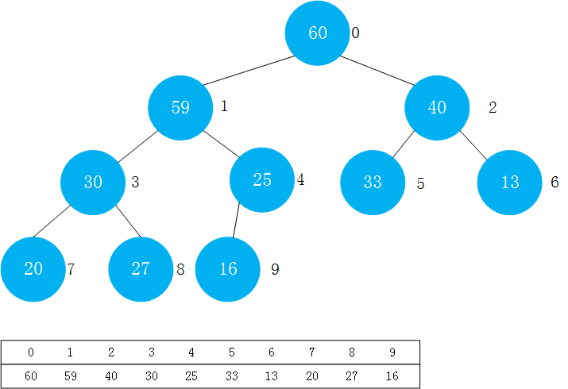

优先队列一般都是基于堆的，所以先写堆的实现。

# 堆

* 堆中某个节点的值总是不大于或不小于其父节点的值(所以分为最大堆和最小堆)
* 堆总是一棵完全二叉树

另外要注意：节点值的大小和节点所处的层次是没有关系的

本文以最大堆为例，进行书写。

## 堆的表示方法——数组

堆的一种底层表示方法是使用动态数组实现，关于动态数组的实现见：https://homxuwang.github.io/2018/07/17/%E6%95%B0%E7%BB%84/



堆的实现代码：
```
public class MaxHeap<E extends Comparable<E>> {
    private Array<E> data;

    public MaxHeap(int capacity){
        data = new Array<>(capacity);
    }

    public MaxHeap(){
        data = new Array<>();
    }

    //返回堆中的元素个数
    public int size() {
        return data.getSize();
    }

    //判断堆是否为空
    public boolean isEmpty() {
        return data.isEmpty();
    }

    //返回一个完全二叉树的数组表示中，一个索引所表示的元素的父亲节点的索引
    private int parent(int index){
        if(index == 0)
            throw new IllegalArgumentException("index 0 doesn't have parent;");
        return (index-1) / 2;
    }

    //返回一个完全二叉树的数组表示中，一个索引所表示的元素的左孩子的索引
    private int leftChild(int index){
        return index * 2 + 1;
    }

    //返回一个完全二叉树的数组表示中，一个索引所表示的元素的右孩子的索引
    private int rightChild(int index){
        return index * 2 + 2;
    }

    //向堆中添加一个元素
    public void add(E e){
        data.addLast(e); //先向末尾添加元素
        //调用siftUp函数，进行上浮操作,以维护堆的性质
        siftUp(data.getSize() - 1);
    }

    //需要上浮的元素的索引
    private void siftUp(int k){
        //如果k满足索引大于零,且其父亲节点的值小于它的值，则进行上浮操作
        while (k > 0 && data.get(parent(k)).compareTo(data.get(k)) < 0){
            swap(k,parent(k));
            k = parent(k);
        }
    }

    //定义一个交换的函数
    private void swap(int i , int j){
        if(i < 0 || i >= data.getSize() || j < 0 || j>= data.getSize()){
            throw new IllegalArgumentException("Index is illegal.");
        }
        E temp = data.get(i);
        data.set(i,data.get(j));
        data.set(j,temp);
    }

    //查看堆中的最大元素
    public E findMax(){
        if(data.getSize() == 0)
            throw new IllegalArgumentException("Can not findMac in a empty heap");
        return data.get(0);
    }

    //取出堆中的最大元素
    public E extractMax(){
        E ret = findMax();

        swap(0,data.getSize() - 1);
        data.removeLast();
        siftDown(0);

        return ret;
    }

    //下沉操作
    private void siftDown(int k){
        while (leftChild(k) < data.getSize()){//如果k没有左右孩子，则循环终止

            int j = leftChild(k);//j为k的左孩子的索引
            if(j + 1 < data.getSize() && data.get( j + 1 ).compareTo(data.get(j)) > 0){//如果k有右孩子,并且右孩子的节点的值大于左孩子的节点的值
                j = rightChild(k);
                //此时，data[j]是leftChild和rightChild中的最大值
            }
            if(data.get(k).compareTo(data.get(j)) >= 0) // 如果k的值大于其左右孩子的值，则满足了最大堆的另一个性质，可以退出循环体
                break;
            //否则交换k和j位置,并且k赋值为j，继续进行下一个循环
            swap(k,j);
            k = j;
        }
    }
}
```
* 在数组中，一个父亲节点其所有节点的索引(假设索引以0开始)为：
```
Index_leftChild  = index_Father * 2 + 1;
Index_rightChild = index_Father * 2 + 2;
```
* 如果知道一个孩子节点的索引(假设索引以0开始)求其父亲节点的索引:
```
index_Father = ( index_Child - 1 ) / 2;
```
上面两个求法可以用数学归纳法进行证明。

* `Sift Up`操作很简单，即新添加的元素先放到数组的末尾位置，这时候满足了完全二叉树的性质。但是它不一定满足总是不大于或者不小于其父亲节点的值。所以这时候的操作是，这个值要与它的父亲节点、爷爷节点……对比，直到放在合适的位置。因为方法中总结了找到一个节点的父亲节点的方法:`faterIndex = (index-1) / 2`。以一个最大堆为例，让新加入的节点和父亲节点对比，如果它大于其父亲节点，则交换，继续对比其父亲节点，直到它小于等于其父亲节点为止。

* `Sift Down`操作，即取出最大堆的堆顶的元素（取出操作只能取出这个最大的元素，而不能取出别的元素）。因为最大的元素取出后，其左右的树结构就是两个单独的子树，那么要给这两个子树找一个新的父节点，操作如下：
1. 将堆中的最后一个元素放在堆顶
2. 删除掉最后一个元素（这时候满足完全二叉树的性质）
3. 将堆顶元素与左右孩子中`大于它`且`较大`的数进行交换
4. 交换后的新位置继续与孩子节点中`大于它`且`较大`的数进行交换
5. 继续操作直到它大于其左后孩子或者它没有左右孩子

优点：add操作和extractMax操作的时间复杂度都是O(logn)

* 其中`swap`交换函数我写在了堆这个类中，可以在Array类中定义交换函数，在堆类中直接调用即可。

## Heapify 和 replace操作
### replace
replace：取出最大元素后放入新元素
* step1: extractMax -> step2: add (2O(logn))
* setp1: 替换堆顶元素 -> step2: Sift Down (O(logn))
```
//取出堆中的最大元素，并替换成e
public E replace(E e){
    E ret = findMax();
    data.set(0,e);
    siftDown(0);
    return ret;
}
```
### Heapify
将任意数组整理成堆的形状

* 扫描数组，放如堆的新的对象中再返回 (O(nlogn))
* 可以先把数组看成一棵完全二叉树,从最后一个非叶子节点开始进行`Sift Down`操作。(找到最后一个非叶子节点的方法：拿到最后一个节点的索引，然后计算他的父亲节点的索引即可) step1: 找到最后一个非叶子节点，进行`Sift Down`操作 step2: 倒数第二个非叶子节点进行`Sift Down`操作 ... 以此类推 直到索引为0的非叶子节点完成`Sift Down`操作  O(n)
* Heapify一般可以在构造函数中进行(用一个数组初始化堆)),所以Array类也要支持一个用数组初始化动态数组的构造函数

Array类的构造函数：

```
public Array(E[] arr)  {
  data = (E[])new Object[arr.length];
  for(int i = 0 ; i < arr.length ; i ++){
    data[i] = arr[i];
  }
  size = arr.length;
}

```

MaxHeap的构造函数：
```
public MaxHeap(E[] arr){
  data = new Array<>(arr);
  for(int i = parent(arr.length - 1) ; i >= 0 ; i--)
  siftDown(i);
}
```

# 优先队列

优先队列就是一个队列，要满足队列的所有属性方法，所以要实现队列接口，关于队列的实现见：https://homxuwang.github.io/2018/07/17/%E5%AE%9E%E7%8E%B0%E6%A0%88%E5%92%8C%E9%98%9F%E5%88%97/

优先队列的底层是使用堆来实现，同样还是以最大堆为例。

```
public class PriorityQueue<E extends Comparable<E>> implements Queue<E> {
    private MaxHeap<E> maxHeap;
    public PriorityQueue(){
        maxHeap = new MaxHeap<>();
    }
    @Override
    public int getSize() {
        return maxHeap.size();
    }

    @Override
    public boolean isEmpty() {
        return maxHeap.isEmpty();
    }

    @Override
    public void enqueue(E e) {
        maxHeap.add(e);
    }

    @Override
    public E dequeue() {
        return maxHeap.extractMax();
    }

    @Override
    public E getFront() {
        return maxHeap.findMax();
    }
}
```

* java.util中的PriorityQueue默认是用的最小堆，具体方法名也有一些区别

