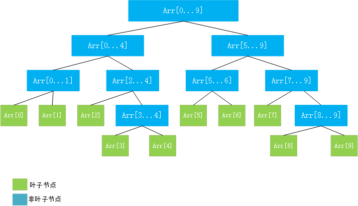
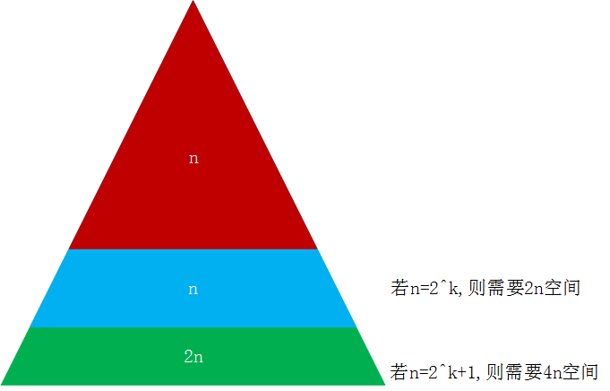

# 定义

当更关心某个区间上的问题时，使用线段树（区间树）会更方便。

* 线段树是一种二叉搜索树
* 线段树每个节点存放一个区间内相应的信息
* 一般用静态数组表示
* 线段树不一定是一棵完全二叉树
* 线段树是平衡二叉树（最大深度和最小深度的差最大为1）

例如，如果线段树想表示区间的和，那么每个节点存放的不是对应的数组，而是这个区间的和。

线段树依然可以使用数组表示。
那么对于一个区间有n个元素，数组的大小该如何确定？
对于一个满二叉树，如果有h层（从0层到h-1层），那么h层就有`2^h-1`个节点，差不多是`2^h`，最后一层(h-1)层，有`2^(h-1)`个节点，最后一层的节点的数目大约是前面的几点数目之和。

所以，如果用数组开辟空间，那么如果`n=2^k`(即恰好为2的整数次幂),需要2n的空间（这是满二叉树的情况），但是如果`n=2^k+1`（即n>2^k,也就是最坏的情况），则需要4n的空间。

结论：因为线段树不考虑添加元素，也就是区间的大小是固定的，所以使用4n的静态空间就可以满足所有情况。（这里有空间浪费）

# 实现

线段树的根节点的信息，是两个孩子节点的信息的综合。比如求和，根节点的值就是左右孩子节点的值之和，依次类推，那么可以采用递归的方法进行求值。

