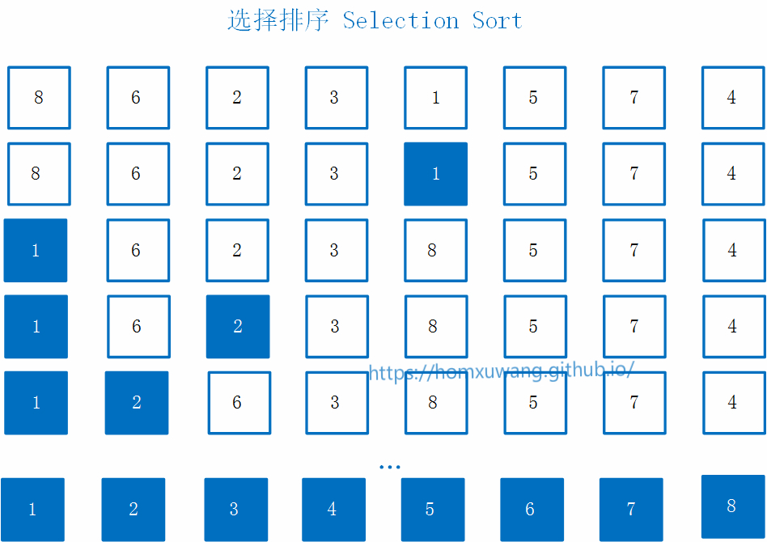
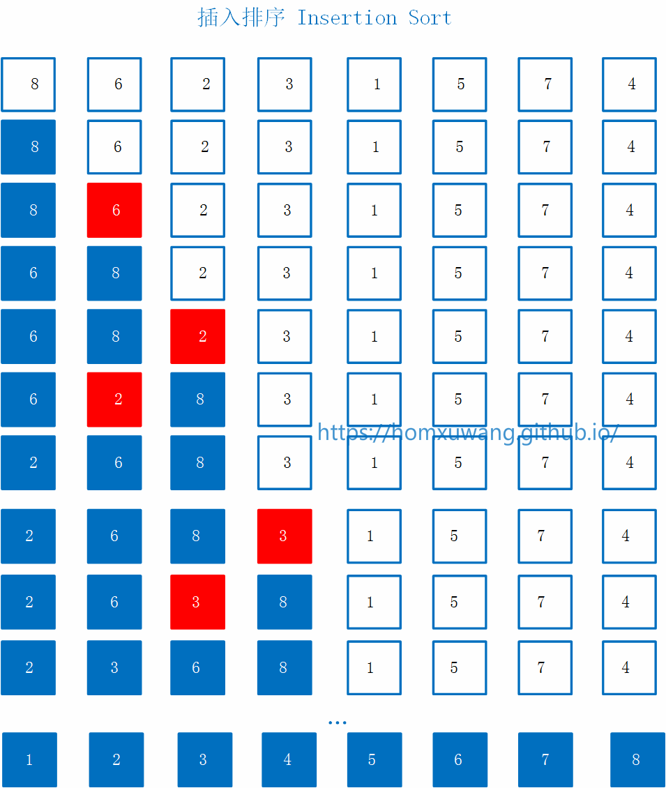
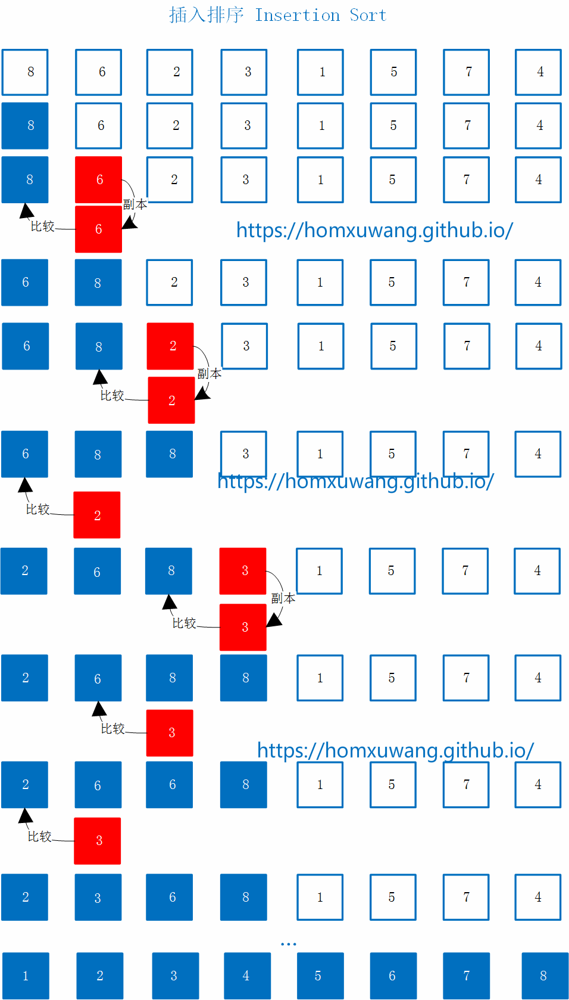
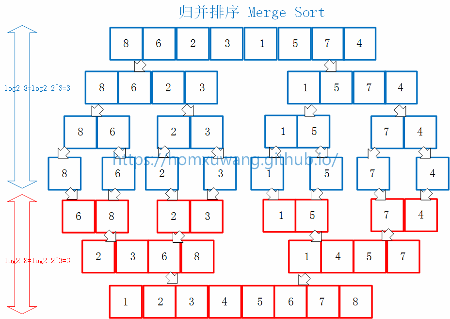
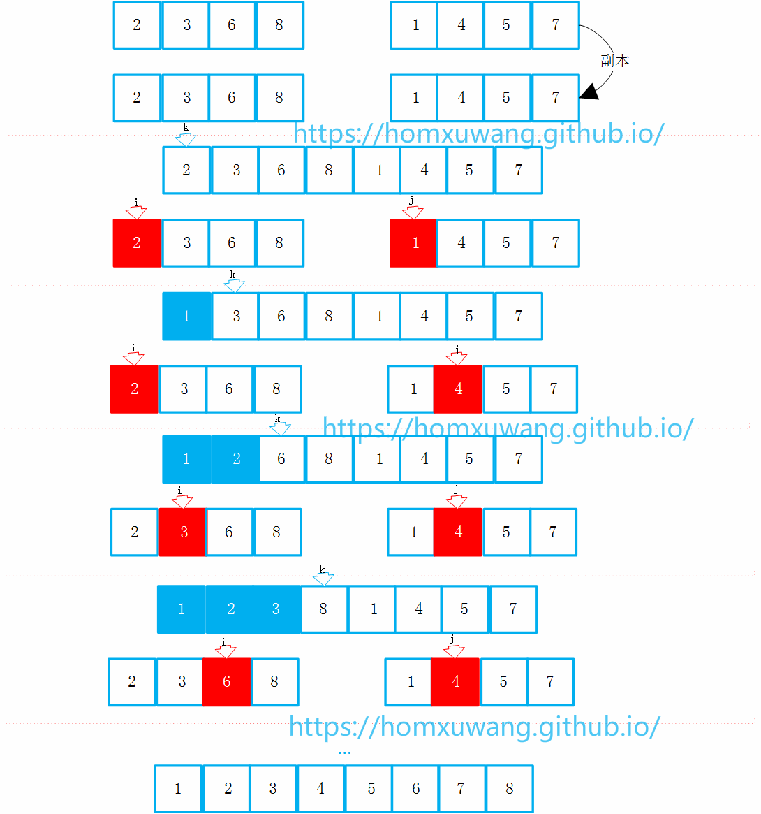
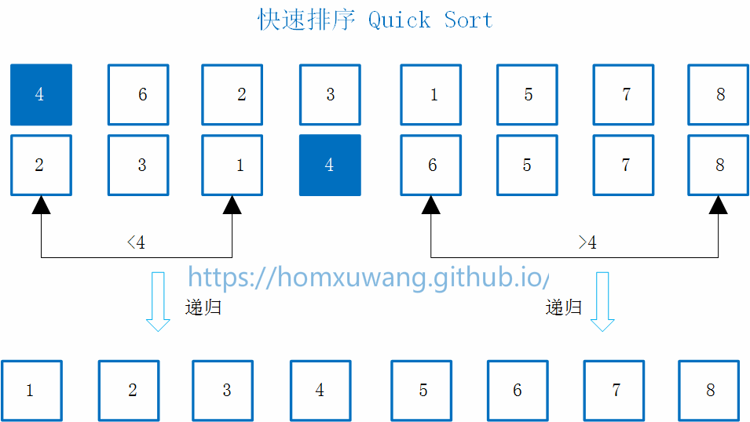
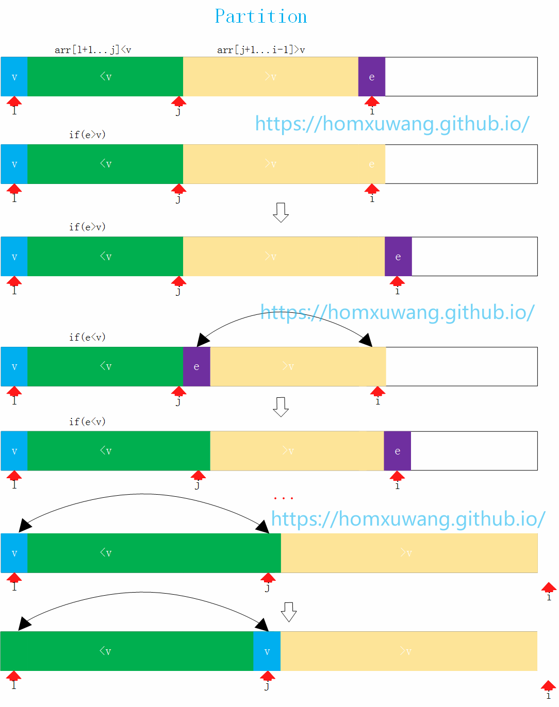

最近在学习数据结构和算法，这里总结一下学习的排序算法。

# 选择排序 - SelectionSort

**基本思路**:
假设有一个数组（如图所示），进行从小到大的排序。首先在整个数组范围里，找出要放在第一个位置的数，也就是最小的数：1，然后将1和现在的第一名的位置8进行换位，经过交换以后，1所处的位置就是最终排序所在的位置，这样就继续在剩下的部分找此时最小的数，也就是2，然后把2和相应的第二个位置所在的元素进行交换，此时1和2两个元素也已经是最终排好序的结果。整个过程以此类推，继续在剩下的部分中找此时最小的元素，然后进行交换位置。。。。。



**代码实现**：

```cpp

//arr为要进行排序的数组，
//n为数组的元素个数，即数组大小

template<typename T>
void selectionSort(T arr[],int n ){
    for(int i=0;i<n;i++){
        //寻找[i,n)区间里的最小值
        int minIndex = i;  //记录当前所找的最小值所处索引的位置，初始化在位置i
        for( int j= i+1;j<n;j++){
            if(arr[j] < arr[minIndex]) //比较j位置的元素是否小于minIndex位置的元素，如果小于则更新当前的minIndex
                minIndex = j;
        }  //此时已经找到了[i,n)区间里的最小值，并且记录其位置已经记录下来
        swap(arr[i] , arr[minIndex]);  //如果使用std标准库不行，有可能需要引入algorithm标准库
    }
}
```

# 插入排序 - InsertionSort

**基本思路**：
开始只考虑8这个元素的时候，它就已经排好序了。
接着看6这个元素,接下来的步骤是把6与它前面的数组进行比较，放在合适的位置，当6与8比较时，6<8，所以6在8前面位置。
接着看2这个元素，2与它前面的数组进行比较，2<8，所以2和8交换一次位置，2继续和6比较，2<6，所以2和6交换位置，此时2在最前面的位置。
接着看3这个元素，3比8小，所以交换一次位置，3又比6小，所以交换一次位置，3比2大所以不进行交换操作，3插入在2和6中间，这时前面的4个元素排序完成。
以此类推。



**代码实现**：

```cpp
template<typename T>
void insertionSort (T arr[] , int n){
    //从i=1开始，因为对插入排序来说，第0个位置不用考虑
    for(int i = 1 ; i < n ; i++){
        //寻找arr[i]合适的插入位置
        for(int j = i ; j > 0 ; j-- ){
            if ( arr[j] < arr[j-1] )
                swap(arr[j] , arr[j-1]);
            else //如果arr[i]元素已经在合适的位置，则可以直接进入下一个循环
                break;
        }
    }
      //下面是简化后的代码
      //  for(int j = i ; j > 0 && arr[j] < arr[j-1] ; j-- ){
      //      swap(arr[j] , arr[j-1]);
      //  }
}
```

插入排序和选择排序相比，如果满足了条件就有机会提前结束，所以它的排序效率理论上要比选择排序高
但是实际上它的运行时间比选择排序要慢，这是因为其swap操作较多，浪费了时间，所以针对这个地方进行改进



**改进代码思路**:
首先,对位置0处的元素不作处理。

接着，看`位置1`处的`元素6`，首先对`元素6`做一个副本保存起来，然后看`元素6`是否应该在当前位置，即让他与前面的元素进行对比，如果小于前面的元素，则当前元素位置的值赋值为前一个元素的值，前一个元素位置的值赋值为刚才保存起来的副本（即当前元素的值）。（其实这也是相当于一个交换操作，在满足前一个元素大于当前元素值的情况下，进行交换值操作）

接着，看`位置2`处的`元素2`，首先对`元素2`做一个副本保存起来，然后`元素2`与前一个`元素8`比较，2<8，则将`元素2`处的值赋值为8；接着再比较`位置1`处的`元素8`与`位置1`处的`元素6`的大小，将`位置1`处的值赋值为`元素6`，接着将`元素2`放在第一个位置。这样就少进行了交换的操作。

接着，看`元素3`，首先对`元素3`做一个副本保存起来，然后看`元素3`该不该放在当前位置，发现3<8，所以这个位置赋值为8；然后看3是不是该放在刚才`元素8`的位置，发现`元素3`比`元素6`小，所以`元素6`放在刚才`元素8`的位置；然后看`元素3`是不是该放在刚才`元素6`的位置，发现`元素3`比`元素2`大，所以`元素3`应该放在这个位置。

这样很多交换操作就通过赋值进行取代了，所以性能更好。

**改进代码**：
```cpp
//改进代码
template<typename T>
void insertionSort (T arr[] , int n){
    //从i=1开始
    for(int i = 1 ; i < n ; i++){
        T e = arr[i]; //用e暂存i位置的数
        int j;        //保存元素e应该插入的位置
        for(j = i ; j > 0 && arr[j-1] > e ; j--){
            arr[j] = arr[j-1];
        }
        arr[j] = e;
    }
}
```
# 归并排序 - MergeSort

## 自顶向下的归并排序

**基本思路**：
所谓归并排序，有两大步，一步是`归`，一步是`并`。

当对一个数组进行排序的时候,先把这个数组分成一半，然后分别把左边的数组和右边的数组排序,之后再归并起来。在对左边数组和右边的数组进行排序的时候，再次分别把左边的数组和右边的数组分成一半，然后对每一个部分进行排序。一样的，对这每一个部分进行排序的时候，再次把他们分成一半，直到它们只含有一个元素的时候，已经是有序了。（蓝色部分）

这时候就对上面最终分割完成的各个部分进行归并。在归并到上一个层级之后，继续进行归并,逐层上升，进行归并，直到归并到最后一层的时候，整个数组就有序了。（红色部分）

可以看到，对图中的8各元素进行归并的时候，分成3级，第三级就可以把数组分成单个元素了，这样每次二分，就是`log2 8 = 3`，如果是N个元素，则有`log2 N`的层级。每一层要处理的元素个数是一样的，则整个归并过程是`N*log(N)`的时间复杂度。



那么问题是假设左半部分和右半部分已经排好了序，怎么把他们合并成一个有序的数组。
这个过程需要为数组开辟一个相同大小的临时空间进行辅助,如下图。
在合并成一个数组的过程中，需要3个索引：k是最终在归并过程中要跟踪的位置，i和j分别表示两个排好序的数组，当前要考虑的元素项。
首先看1和2两个元素，谁应该放在k位置，进行对比后，较小的元素1放在k位置。这时候k++，j++。
紧接着，元素2和元素4进行对比，较小的元素2放在当前的k位置，这时候k++,i++。
继续元素3和元素4进行对比，较小的元素3放在当前的k位置，这时候k++,i++。
继续元素6和元素4进行对比，较小的元素4放在当前的k位置，这时候k++,j++。
。。。。
算法过程中，需要维护k,i,j满足算法的定义。并且需要跟踪i,j的越界情况。
这里定义l(left),r(right),和m(middle)分别为整个数组的最左边的元素，数组最右边的元素和中间位置的元素(这里指定为第一个数组的最后一个元素)。这里再做一个说明，这里的定义整个算法的数组是前闭后闭的数组。 




**代码实现**：
```cpp
//将arr[l...mid]和arr[mid+1...r]两部分进行归并
template<typename T>
void __merge(T arr[] , int l , int mid , int r ){

    //开辟一段临时空间，大小和arr[]的空间一样大
    T aux[r-l+1];
    for( int i = l ; i <= r ; i++ ) //因为是闭区间,所以用i<=r
        aux[i-l] = arr[i]; // aux[]是从0开始的，arr[]是从l开始的，所以有个i-l的偏移量

    //设置两个索引，指向两部分的开头
    int i = l , j = mid + 1;
    for( int  k = l ; k <= r ; k++){ //使用k索引进行遍历，每一次决定arr[k]的位置应该是谁
        //先判断i和j是否越界
        //这时候说明左半部分已经遍历完,k没有遍历完，j索引所指数组的元素还没有归并回去,则剩下的k索引所指的元素就对应j-l所指的元素
        if(i > mid ){ 
            arr[k] = aux[j-l];
            j++;
        }
        else if(j>r){//同上
            arr[k] = aux[i-l];
            i++;
        }
        else if(aux[i-l] < aux[j-l]){
            arr[k] = aux[i-l];
            i++;
        }
        else{
            arr[k] = aux[j-l];
            j++;
        }
    }
}

//递归使用归并排序，对arr[l...r]的范围进行排序（r是最后一个元素的位置）
template<typename T>
void __mergeSort(T arr[] , int l , int r ){

    if(l >= r)
        return;

    int mid = (l+r)/2;

    //对左右两部分进行归并排序
    __mergeSort(arr,l,mid);
    __mergeSort(arr,mid+1,r);

    //将归并排序好的两部分[l,mid]和[mid+1,r]进行merge操作
    if( arr[mid] > arr[mid+1] )
        __merge(arr, l , mid , r);


}

template<typename T>
void mergeSort(T arr[],int n){

    //arr:当前要处理的数据，0:要处理的数据的开始位置，n-1:要处理的数据的结束位置
    __mergeSort(arr , 0 , n-1 );
}
```

## 自底向上的归并排序

**基本思路**：
自底向上的归并排序的基本原理是，给定一个数组，从左向右将数组依次划分为小段，如两个元素一个小段，然后进行归并排序。当这一轮归并排序完成之后，再四个元素一个小段进行归并排序，最后八个元素一个小段进行归并排序。以上面的数组为例，这时候就排序完成了。
这种方法并不需要递归，只需要迭代就可以完成排序操作。

**代码实现**：
```cpp
template<typename T>
void __merge(T arr[] , int l , int mid , int r ){
    //开辟一段临时空间，大小和arr[]的空间一样大
    T aux[r-l+1];
    for( int i = l ; i <= r ; i++ ) //因为是闭区间,所以用i<=r
        aux[i-l] = arr[i]; // aux[]是从0开始的，arr[]是从l开始的，所以有个i-l的偏移量

    //设置两个索引，指向两部分的开头
    int i = l , j = mid + 1;
    for( int  k = l ; k <= r ; k++){ //使用k索引进行遍历，每一次决定arr[k]的位置应该是谁

        //先判断i和j是否越界
        if(i > mid ){ //这时候说明左半部分已经遍历完,k没有遍历完，j索引所指数组的元素还没有归并回去,则剩下的k索引所指的元素就对应j-l所指的元素
            arr[k] = aux[j-l];
            j++;
        }
        else if(j>r){//同上
            arr[k] = aux[i-l];
            i++;
        }
        else if(aux[i-l] < aux[j-l]){
            arr[k] = aux[i-l];
            i++;
        }
        else{
            arr[k] = aux[j-l];
            j++;
        }
    }
}


//自底向上的归并排序
template<typename T>
void mergeSortBU(T arr[] , int n){
    for(int sz = 1 ; sz <= n ; sz += sz) //size从1开始，每次加一个size的大小，直到是n大小
        //第二层循环是每次归并过程中起始的元素的位置
        // i+sz<n 保证了第二部分的存在，也保证了i+sz-1是不会越界的
        for(int i = 0; i + sz < n ; i += sz + sz )
            //对 arr[i...i+sz-1]和arr[i+sz...i+2*sz-1]进行归并
            //min()保证i+sz+sz-1越界的时候取n-1
            __merge(arr , i , i + sz - 1 , min(i + sz + sz -1, n - 1);

    //自底向上的归并排序方法没有用到数组的索引，所以可以很好的对链表结构进行排序
}
```

# 快速排序 - QuickSort

**基本思路**：
以下图的数组为例，首先选定一个元素4，把它挪到当它在排好序的时候，应该处的位置，当它处在这个位置之后，使得这个数组有了一个性质：在4之前的数都小于4，在4之后的数都大于4。接下来，对小于4的子数组和大于4的子数组分别继续进行快速排序。这样逐渐递归，完成整个排序过程。



那么关键问题是怎么把4这个元素放在正确的改放的位置，这个过程称为Partition。
通常使用数组的第一个元素作为分界的标志点，第一个位置记作l，然后逐渐遍历右边没有被访问的元素，在遍历的过程中，逐步整理让元素一部分是`>v`一部分是`<v`的,将大于v和小于v的分界点的索引记为j，当前访问的元素e的索引记作i。
下面讨论i位置的e该如何处理，如图。如果`e>v`则将它放在这个位置不变，i++继续讨论下一个元素。否则如果`e<v`则将i位置的e与j+1位置的元素交换，j++,i++，继续考察下一个元素。
依次继续进行操作，直至遍历完数组的所有元素。
这时候要将v放在数组中合适的位置，即将索引l位置的v与索引j位置的元素进行交换。
最终完成此次操作。


**代码实现**：
```cpp
//对arr[l...r]部分进行partition操作
//返回p,使得arr[l...p-1] < arr[p] ; arr[p+1...r] > arr[p]
template<typename T>
int __partition(T arr[] , int l , int r ){

    //先取第一个元素作为标准
    T v = arr[l];

    //arr[l+1...j]<v ; arr[j+1...i) > v ，后面是开区间是因为i是当前要考察的元素
    int j = l ;
    for( int i = l + 1 ;i <= r ; i++ ){
        if( arr[i] < v ){
            swap( arr[j+1] , arr[i] );
            j++;
        }
    }

    swap( arr[l] , arr[j] );

    return j;
}

//对arr[l...r]部分进行快速排序
template<typename T>
void __quickSort(T arr[] , int l , int r ){

    if(l >= r)
        return;

    int p = __partition(arr, l , r );

    __quickSort(arr , l , p-1 );
    __quickSort(arr , p + 1 , r );
}

template<typename T>
void quickSort(T arr[] , int n ){

    //调用递归函数
    __quickSort(arr, 0 , n - 1);
}
```